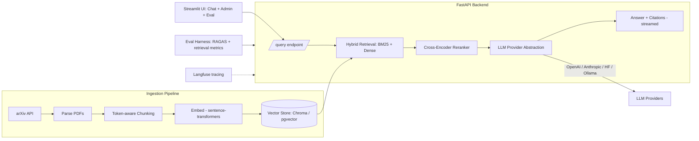

# arXiv RAG Assistant

[](https://github.com/your-org/arxiv-rag/actions/workflows/ci.yml)


A production-grade Retrieval-Augmented Generation (RAG) app that ingests arXiv
AI/ML papers and answers questions with **inline citations**. Built like real
software: typed, tested, linted, containerized, evaluated, traced, and deployed
with a free live demo.

## Features

- **Hybrid retrieval** — BM25 + dense (`sentence-transformers`) with a
  cross-encoder reranker, plus an ablation showing metric gains.
- **Streamlit UI** — Chat streams answers with sources; Admin ingests papers;
  Eval shows last-query stats plus the latest `python -m eval` report.
- **Citations + guardrail** — answers cite source page/section and refuse to
  answer when retrieval confidence is low.
- **Streaming answers** with token/cost estimates on `/query`; optional Langfuse
  tracing when `LANGFUSE_*` keys are set.
- **Pluggable LLMs** — OpenAI, Anthropic, Hugging Face Inference, or local
  Ollama via a single provider abstraction. Free/open default path costs $0.
- **Eval harness** — golden Q/A, retrieval ablation (dense vs hybrid vs
  rerank: hit-rate / recall@k / MRR), optional RAGAS (`--with-ragas`).
- **Ops** — one-command `docker compose up`, GitHub Actions CI, pinned deps, and
  a free Hugging Face Spaces live demo.

## Architecture



## Project layout

```
arxiv-rag/
├─ app/
│  ├─ config.py          # pydantic-settings configuration
│  ├─ ingest/            # arXiv fetch, PDF parse, chunk, embed, index
│  ├─ retrieval/         # BM25 + dense hybrid, cross-encoder reranker
│  ├─ llm/               # provider abstraction (OpenAI/Anthropic/HF/Ollama)
│  └─ api/               # FastAPI app: /query, /ingest, /health
├─ ui/                   # Streamlit app (Chat, Admin, Eval tabs)
├─ eval/                 # golden Q/A set + metrics + before/after report
├─ tests/                # pytest unit + integration tests
├─ huggingface/          # HF Spaces Dockerfile + README (live demo)
├─ Dockerfile
├─ docker-compose.yml    # api, ui, +pgvector, +ollama profiles
├─ pyproject.toml        # tooling config + loose dep bounds
├─ requirements.txt      # pinned runtime deps (source of truth)
└─ requirements-dev.txt  # pinned dev/test deps
```

## Quickstart

### Local (Python)

```bash
cd arxiv-rag
python -m venv .venv && source .venv/bin/activate   # Windows: .venv\Scripts\activate
pip install -r requirements.txt -r requirements-dev.txt
cp .env.example .env                                # optional; defaults work

# Ingest a paper, then retrieve (working today)
python -m app.ingest --ids 1706.03762 --max-results 1
python -m app.retrieval --query "What is multi-head attention?"

# Smoke-test the configured LLM (default: Hugging Face)
python -m app.llm --prompt "Say hello in one sentence."
python -m app.llm --prompt "Say hello." --stream --sse

# Run the API ( /health, /ingest, /query )
uvicorn app.api.main:app --reload
# Example:
# curl -X POST http://localhost:8000/query -H "Content-Type: application/json" ^
#   -d "{\"question\": \"What is multi-head attention?\"}"

# In another shell, run the UI (Chat / Admin ingest / Eval stats)
streamlit run ui/app.py
# Set LLM_PROVIDER=ollama (and LLM_MODEL) in the API process if using local Ollama

# Retrieval ablation report (needs ingested papers; optional --with-ragas)
python -m eval --report eval/reports/latest.md
```

### Docker Compose

```bash
cd arxiv-rag
cp .env.example .env
docker compose up                     # api + ui (free/open path, Chroma)
docker compose --profile pgvector up  # add Postgres + pgvector
docker compose --profile ollama up    # add local Ollama LLM
```

- API: http://localhost:8000 — `/health`, `/ingest`, `/query` (SSE when `stream=true`)
- UI: http://localhost:8501 — Chat (streaming + citations), Admin (ingest), Eval (live stats + harness report)

## Configuration

All settings are typed in [`app/config.py`](app/config.py) and read from
environment variables / `.env`. See [`.env.example`](.env.example) for every
option. The default path (`LLM_PROVIDER=huggingface`, `VECTOR_STORE=chroma`)
requires no secrets.

## Development

```bash
ruff check . && ruff format --check .   # lint + format
mypy app                                # type check
pytest --cov=app                        # tests
```

CI runs all of the above plus a Docker build on every push/PR
(see [`.github/workflows/ci.yml`](.github/workflows/ci.yml)).

## Live demo

Deployed free on Hugging Face Spaces — see [`huggingface/`](huggingface/) for the
Space Dockerfile and deployment notes. _(Link added once deployed.)_

## License

MIT
